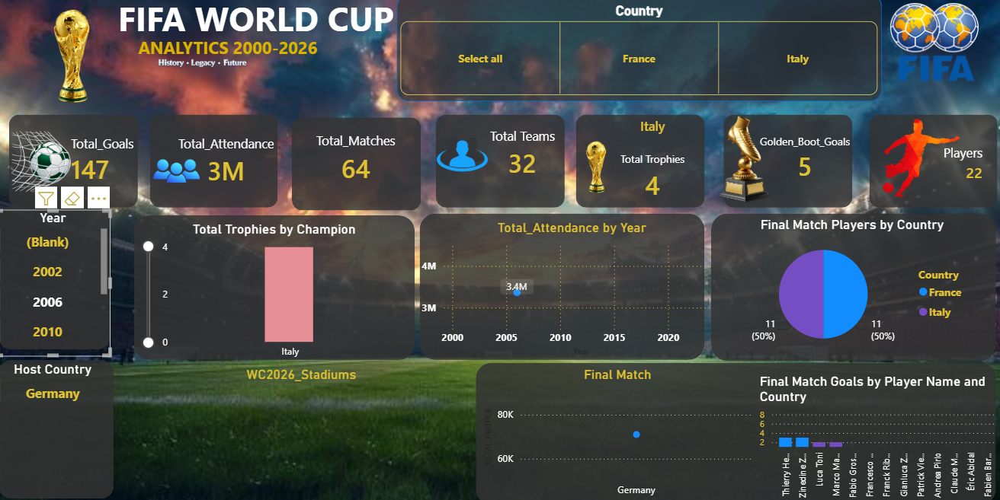
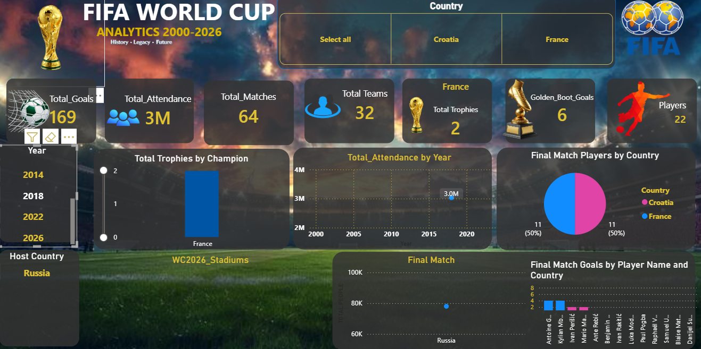
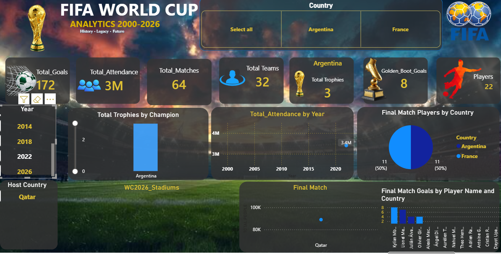

## 📌 Project Overview

The FIFA World Cup Analytics Dashboard provides a comprehensive analysis of tournament history, team performance, player statistics, and key performance indicators. It enables users to explore historical trends, compare teams, and evaluate player performance through dynamic and interactive dashboards.

---

## 🎯 Objectives

- Analyze FIFA World Cup tournaments (2002–2026)
- Compare team performances across different editions
- Evaluate player statistics and achievements
- Visualize tournament trends using interactive charts
- Build an engaging and user-friendly Power BI dashboard

---

## 📊 Dashboard Features

- 📈 Tournament Overview
- 🏆 Champion Analysis
- ⚽ Player Performance
- 🌍 Team Comparison
- 📅 Year-wise Analysis
- 🎯 Goals & Assists Statistics
- 📌 Interactive Filters & Slicers
- 📉 KPI Cards
- 📊 Custom Visualizations

---

## 🛠️ Technologies Used

- Microsoft Power BI
- Power Query
- DAX (Data Analysis Expressions)
- Data Modeling
- Microsoft Excel / CSV

---

## 📂 Project Structure

```
FIFA-World-Cup-Analytics/
│
├── FIFA Analytics.pbix
├── README.md
├── Dataset/
├── Images/
└── LICENSE
---
# FIFA World Cup Analytics Dashboard

## Final Matches




## Stadiums 2026


---


## 📌 Key Insights

- Tournament performance over multiple World Cups
- Winning teams and championship history
- Top-performing players
- Goals and assists comparison
- Team participation trends
- Historical tournament statistics

---

## 📈 Skills Demonstrated

- Data Cleaning
- Data Transformation
- Data Modeling
- DAX Calculations
- KPI Design
- Dashboard Design
- Data Storytelling
- Business Intelligence

---

## 🚀 Getting Started

1. Clone this repository.
2. Open **FIFA Analytics.pbix** in Power BI Desktop.
3. Refresh the dataset if required.
4. Explore the interactive dashboard.

---

## 🤝 Contributing

Contributions and suggestions are welcome. Feel free to fork the repository and submit a pull request.

---

## 📄 License

This project is licensed under the MIT License.

---

## 👨‍💻 Author

**Manoj Saini**

Aspiring Data Analyst | Power BI Developer


---

⭐ If you like this project, please consider giving it a **Star** on GitHub!
